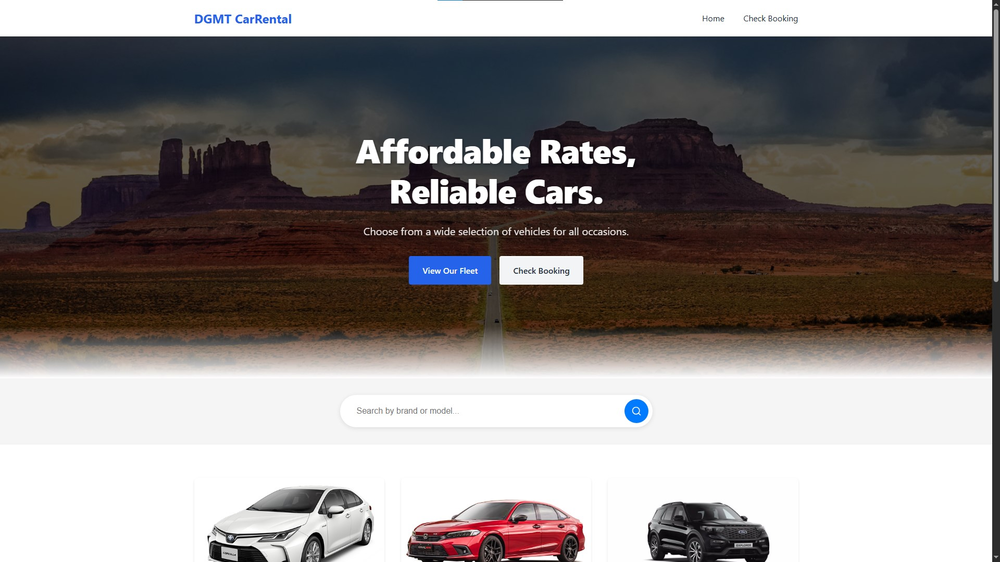

# Car Rental System

A simple car rental system built with HTML, CSS, and PHP for managing car rentals with an intuitive admin dashboard.

## Tech Stack
- **Backend**: PHP (server-side scripting)
- **Database**: MySQL (managed via PHPMyAdmin)
- **Frontend**: HTML, CSS, JavaScript
- **Development Environment**: Laragon (local development server)
- **PDF Generation**: TCPDF library
- **Icons**: Font Awesome
- **Styling**: Custom CSS with responsive design

## Features

### For Customers
- **Car Browsing**: View available cars with search functionality by brand/model
- **Easy Booking**: Book cars without registration required
- **Booking Tracking**: Check booking status using reference number
- **Invoice Generation**: Download PDF invoices for bookings

### For Administrators
- **Dashboard**: Overview statistics and system management
- **Car Management**: Add, edit, delete cars with image uploads
- **Booking Management**: View and manage all customer bookings
- **Report Generation**: Generate PDF reports for all bookings
- **Secure Authentication**: Password-protected admin access